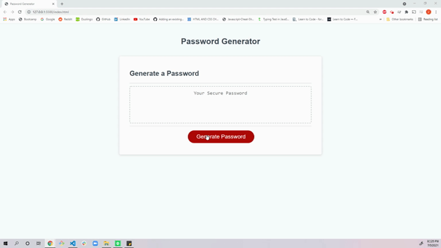

# Password Generator

## What it does
<pre>
Password Generator used to create a unique password depending on user chose of the following
critera.
<ul>
<li>Length of characters between 8-128.</li>
<li>If lower case letters will be used.</li>
<li>If upper case letters will be used.</li>
<li>Id numbers will be used.</li>
<li>if special characters will be used.</li>
</pre>

## How to use it
<pre>
<ul>
<li>User clicks 'Generate Password'</li>
<li>User chooses length of password</li>
<li>Confirms length</li>
<li>User choose if to use lower case characters</li>
<li>User choose if to use upper case characters</li>
<li>User choose if to use numbers</li>
<li>User choose if to use special characters</li>
<li>Password will then generate and appear in text box</li>
<li>Generation will fail is length choosen is not in between
8 and 128 characters</li>
<li>Generation will fail is at least one option is selected 
and user will be asked to try again</i>
</pre>

